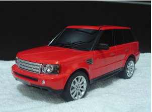

## Bakgrund:

Bilar är typiska exempel på system som innefattar många mindre system som pratar med varandra. Exempelvis så kan lås, larm och lampor aktiveras/avaktiveras med ett enda knapptryck från fjärrkontrollen och inställningar för motor, antisladd system och så vidare kan reglera sig själva utifrån mätvärden från olika sensorer. 

I bilar pratar man om flera olika ECUs - Electronic Control Units, som har hand om dessa delsystem och som inte är helt olika vår microcontroller. Dessa ECU:er kommunicerar med varandra och interagerar med varandra. Ett vanligt protokoll för kommunikation är CAN BUS.

Det här gör bilar till bra exempel på komplicerade system där många delsystem faktiskt inte har någonting alls att göra med själva körandet av bilen.

## Uppgiften:
Tanken med den här uppgiften är att fokusera på kringliggande system i en bil, eller ska vi säga konceptet för kringliggande system i en bil och att bygga ett system med vår microcontroller som hanterar flera mindre bitar i en tänkt bil. 

Det här kommer ske med vad vi har i kit:et och kopplas på vår breadboard, så lite fantasi kommer man ju få använda också. Vi har ju inga hjul t ex, men vi har en motor och en fläkt och den kan visa oss vilket håll motorn snurrar så vi kan avgöra om vi åker framåt eller bakåt. Detsamma gäller för att svänga på hjulen, som får symboliseras av ett servo. Se detta som ett proof-of-concept, som ni får förklara också i samband med redovisningen av projektet. 

**Uppgiften består av några obligatoriska delar som SKA vara med i projektet**:

Bilen ska kunna svänga(med hjälp av servot)
Bilen ska kunna köra framåt och bakåt (med hjälp av IC-krets motordrivare och motor)
Bilen ska kunna tuta (med hjälp av buzzer)
Man ska kunna styra bilen (Styrspaken sköter framåt/bakåt samt svänga höger/vänster + tuta när styrspak trycks ned)

**För er som siktar på högre betyg finns det också möjlighet att bygga på med ytterligare system.**

**Dessa väljer ni själva, kombinerar eller hittar på, men exempelvis:**

<li>Backvarnare: (Med hjälp av LEDs, Buzzer och avståndsmätare HC-SR04)</li>
<li>Dörrlås: (Med hjälp av fjärrkontroll, IR-mottagare, buzzer och LEDS)
<li>Frostvarnare: (Med hjälp av Termometer och LCD)
<li>Automatiskt Helljus: (Med hjälp av Fotoresistor och LED)
<li>Kupé-dimmer:(Ljuset dimmar ned 5 sekunder efter att dörren stängts; dörr symboliseras av en knapp och belysning av en LED)
<li>Heads-up-display: (Visa bensinförbrukning, hastighet osv mha LCD, växla info mha knapp eller potentiometer)
<li>Växelindikator: (med 7-segmentsdisplay)
<li>Hastighetsmätare: (med 4-siffrig 7-segmentsdisplay)
<li>Ytterbelysning (blinkers, bromsljus, backljus, helljus): (Med hjälp av LEDs och knappar